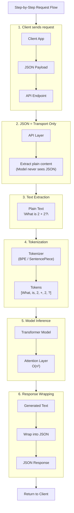

```mermaid
flowchart TD
    Start["Step-by-Step Request Flow"]

    %% STEP 1
    Start --> Step1
    subgraph Step1["1. Client sends request"]
        direction TB
        Client["Client App"]
        Payload["JSON Payload"]
        API["API Endpoint"]

        Client --> Payload
        Payload --> API
    end

    %% STEP 2
    Step1 --> Step2
    subgraph Step2["2. JSON = Transport Only"]
        direction TB
        APILayer["API Layer"]
        Extract["Extract plain content<br/>(Model never sees JSON)"]

        APILayer --> Extract
    end

    %% STEP 3
    Step2 --> Step3
    subgraph Step3["3. Text Extraction"]
        direction TB
        Text["Plain Text<br/>\"What is 2 + 2?\""]
    end

    %% STEP 4
    Step3 --> Step4
    subgraph Step4["4. Tokenization"]
        direction TB
        Tokenizer["Tokenizer<br/>(BPE / SentencePiece)"]
        Tokens["Tokens<br/>[What, is, 2, +, 2, ?]"]

        Tokenizer --> Tokens
    end

    %% STEP 5
    Step4 --> Step5
    subgraph Step5["5. Model Inference"]
        direction TB
        Model["Transformer Model"]
        Attention["Attention Layer<br/>O(n²)"]

        Model --> Attention
    end

    %% STEP 6
    Step5 --> Step6
    subgraph Step6["6. Response Wrapping"]
        direction TB
        Output["Generated Text"]
        Wrap["Wrap into JSON"]
        Response["JSON Response"]

        Output --> Wrap
        Wrap --> Response
    end

    Step6 --> End["Return to Client"]

```
